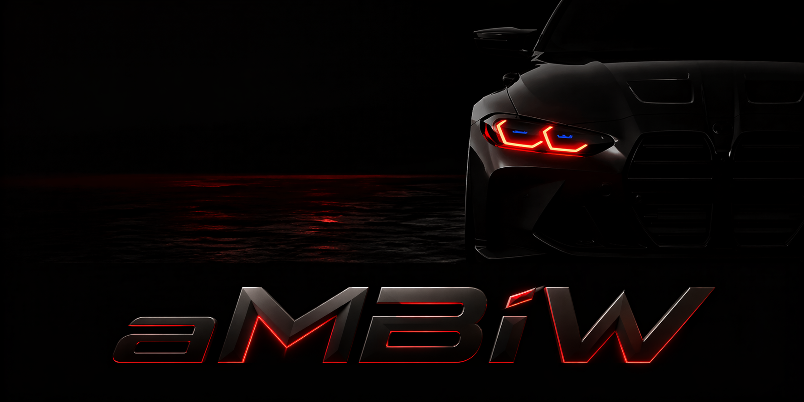

<p align="center">
  
</p>

<p align="center">
<em>An ambient automotive soundscape for focus and calm. (한국어 별칭: 차멍)</em>
</p>

<p align="center">
<a href="LICENSE">
    
</a>


</p>

---

Feel nice and relax with the ambient soundscape of M4 Competition.

It is a totally personal toy project, **not a commercial product**, and runs entirely in the browser.

## Live demo

[ambiw.bnbong.com](https://ambiw.bnbong.com)

## Tech stack

- [Vite 5](https://vitejs.dev/) + React 18 + TypeScript (strict mode)
- [Three.js 0.169](https://threejs.org/) via
  [`@react-three/fiber`](https://github.com/pmndrs/react-three-fiber) and
  [`@react-three/drei`](https://github.com/pmndrs/drei)
- Web Audio API for the looped soundscape
- Self-hosted [Draco](https://google.github.io/draco/) decoder under
  `public/draco/`

## Local development

```bash
npm install
npm run dev      # http://localhost:5173
npm run build    # tsc -b && vite build → dist/
npm run preview  # serve dist/ at :4173
```

## Trademark & attribution

This is an unofficial personal ambient web experiment. 

It is **not** affiliated with, endorsed by, sponsored by, or connected to BMW AG, BMW M GmbH, Sketchfab, or the referenced asset creators. All trademarks and model names belong to their respective owners. 

The full asset attribution, with sources and licenses, lives in:

- The in-app **Credits** modal (bottom-right of the page).
- [`public/assets/models/model-attribution.txt`](public/assets/models/model-attribution.txt)
- [`public/assets/audio/audio-attribution.txt`](public/assets/audio/audio-attribution.txt)

비공식 개인 토이 프로젝트입니다. 

BMW AG · BMW M GmbH · Sketchfab · 에셋 제작자와 제휴/후원/보증 관계가 없습니다. 모든 상표와 모델명은 각 권리자에게 있습니다.

## Required runtime assets

| Path                                          | Size   | Source                                                                                                                                              | Notes                                                            |
| --------------------------------------------- | ------ | --------------------------------------------------------------------------------------------------------------------------------------------------- | ---------------------------------------------------------------- |
| `public/assets/models/m4-competition.glb`     | ~20 MB | Sketchfab, [`d3f07b47…`](https://sketchfab.com/3d-models/2021-bmw-m4-competition-d3f07b471d9f4a2c9a2acf79d88a3645) by Ricy ([@ngon_3d](https://sketchfab.com/ngon_3d)) — CC BY 4.0 | Committed in repo (no Git LFS). The fallback primitive coupe still renders if the file is missing or fails to load. |
| `public/assets/audio/engine_idle.mp3`         | 352 KB | Edited from "AUDIO M4 WAV" by [Andreabarata](https://freesound.org/people/Andreabarata/sounds/335345/) (Freesound, CC0)                              | Committed.                                                      |
| `public/assets/audio/indicator_loop.{mp3,ogg}`| ~52 KB | "BMW Indicator" by [The_Cri](https://freesound.org/people/The_Cri/sounds/545322/) (Freesound, CC0)                                                  | Committed.                                                      |
| `public/draco/draco_decoder.{js,wasm}`        | ~700 KB| Three.js `examples/jsm/libs/draco/gltf/`                                                                                                             | Self-hosted at `/draco/` so the runtime never reaches a CDN.     |

All runtime assets — including the 20 MB GLB — are committed in this repo
under `public/`, so a fresh clone runs end-to-end without any manual download step. The model is included strictly under the existing [Creative Commons Attribution 4.0](https://creativecommons.org/licenses/by/4.0/) terms granted by the original author — see the **Trademark & attribution** section above for the BMW trademark posture.

## License

[MIT License(With CC BY 4.0)](LICENSE)

## Acknowledgements

- 3D model — [Ricy / @ngon_3d](https://sketchfab.com/ngon_3d) on
  [Sketchfab](https://sketchfab.com/), title "2021 BMW M4 Competition", under
  Creative Commons Attribution.
- Engine sound — [Andreabarata](https://freesound.org/people/Andreabarata/sounds/335345/)
  on [Freesound](https://freesound.org/) / mirrored on
  [Pixabay](https://pixabay.com/sound-effects/audio-m4-wav-50124/), title
  "AUDIO M4 WAV", under CC0.
- Turn-signal sound — [The_Cri](https://freesound.org/people/The_Cri/sounds/545322/)
  on Freesound / mirrored on
  [Pixabay](https://pixabay.com/sound-effects/film-special-effects-bmw-indicator-63705/),
  title "BMW Indicator", under CC0.
- Draco decoder — Google, distributed with [Three.js](https://github.com/mrdoob/three.js).
